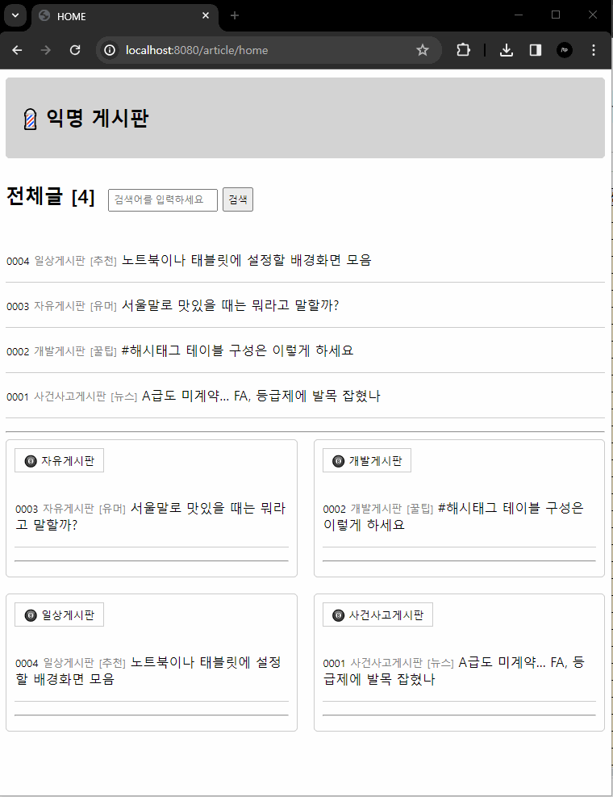
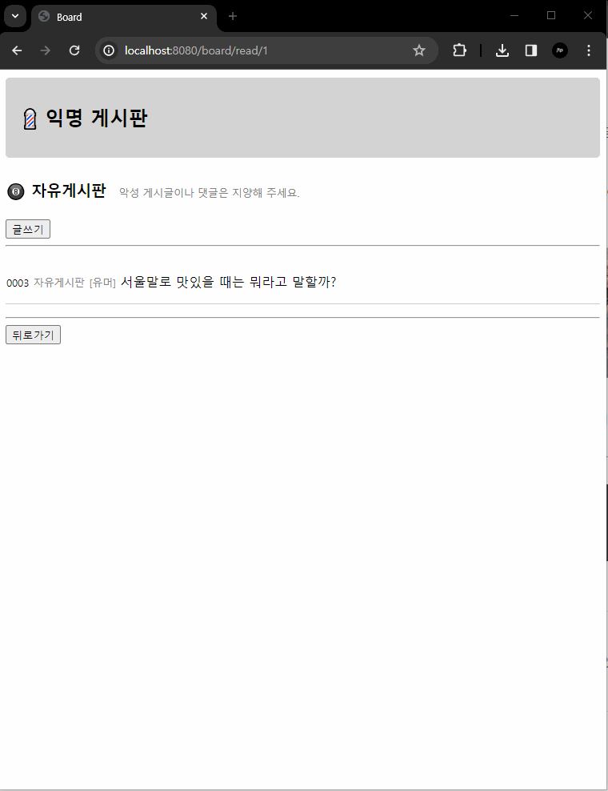
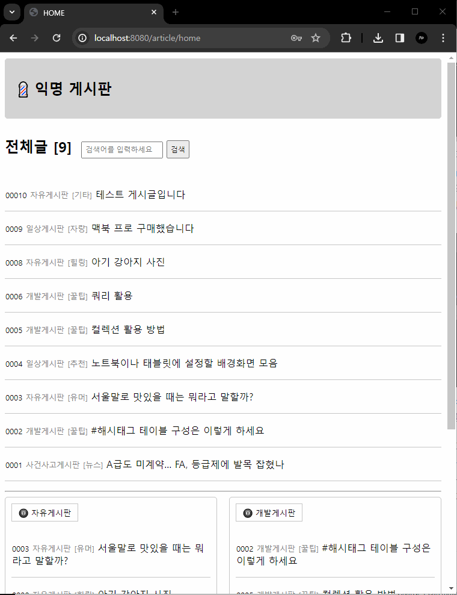
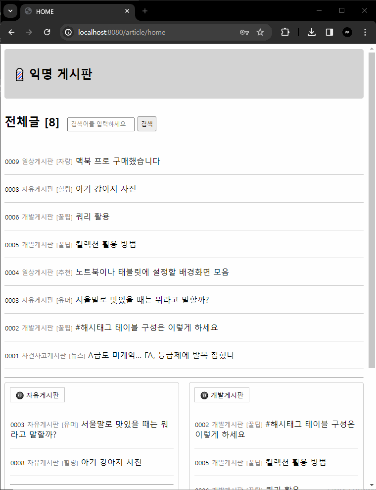
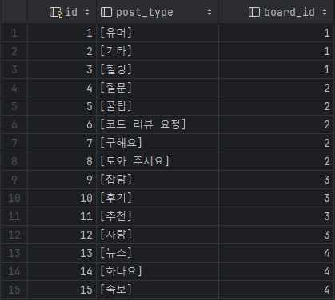

# 익명 의견 교환 웹 페이지 프로젝트 미션


- 익명으로 소통할 수 있는 웹 페이지 제작 미션
  - `미션 수행 기간`: `2024.01.08 ~ 2024. 01. 11`
  

- 필수 과제
  - 게시판 기능: 게시판 전체 목록, 게시판별 게시글 확인 목록 화면 구현
  - 게시글 기능: CRUD 구현, 글을 게시할 게시판 선택 기능 구현, password로 수정 삭제 기능 구현
  - 댓글 기능: 게시글에 속한 전체 댓글 목록 화면, 댓글 작성 화면, password로 수정 삭제 기능 구현


- 도전 과제
  - 해시태그 기능: 게시글 내용에서 (#) 해시태그 단어 추출하여 검색 및 조회 구현
  - 검색 기능: 제목과 내용을 기준으로 검색 기능 구현
  - 이미지 추가 기능: 게시글에 이미지 추가하여 작성 기능 구현


## 1. Board
- 자유 게시판, 개발 게시판, 일상 게시판, 사건 사고 게시판이 있음
- 각 게시판별 게시글 확인 필요

### `Board`
- `category`로 게시판 이름 변수 설정
- `description`으로 게시판 소개 변수 설정
- @Entity @OneToMany -> ArticleList(게시글)
- @OneToMany -> postTypeList(말머리)
- `@Getter`와 `@Setter` 어노테이션으로 코드 간결화 진행 
> ✏ 이후 data.sql 에서 INSERT로 게시판 이름과 해당 게시판의 소개글 데이터를 입력하였다  
> ✏ 소개글 삽입에 대한 고민 이후 생각한 방법으로 만족스러우나 보안 관련한 보완은 필요할 것으로 판단된다

---
### `BoardRepository`
- JPA를 활용하여 기본적인 CRUD가 가능하게 작성


### `BoardServie`
- Service Bean 등록 클래스
- `BoardRepository` 생성자 주입
- `readBoard`와 `readAllBoard`로 Board와 BoardList 반환 메서드 작성

### `BoardController`
- `BoardService`와 `ArticleService` 생성자 주입
- Home 화면에서의 `Board List`의 확인을 위해 `readAll` 작성
- `BoardService`의 readAllBoard를 Model을 사용하여 "board"에 넣고 home으로 return
- 각 Board 별 Article 확인을 위해 `/board/read/{id}` 엔드포인트에 boardView 작성
- 뷰 템플릿에 Board에 속한 Article도 확인해야 하기 때문에 readArticlesByBoardId을 model로 전달


## 2. Article
- 글 작성시 게시하고 싶은 게시판 선택 가능
- password를 가지고 작성하여 수정, 삭제시 입력하였던 password가 일치해야 수행 가능 

### `Article`
- id, title, contents, password의 필드를 가짐
- id는 PK로 지정, `GenerationType.IDENTITY`를 사용하여 id 겸 글 번호 개념 주입
- @Entity @ManyToOne -> Board, @OneToMany -> commentList(댓글)
- `추가` - @ManyToOne -> postType (말머리 지정)

### `ArticleRepository` 
- 기능 사용을 위한 레포지토리 인터페이스 작성 (상동)

### `ArticleService`
- article, board, postType Repository 생성자 주입
- 글 작성 메서드 `write` 작성(postId, boardId를 포함)
- `IllegalArgumentException`으로 예외 처리 작성
- 전체 게시글의 수를 view에서 보여주고 싶어 추가 로직 작성
```Java
    public Long getTotalArticleCount() {
        return articleRepository.count();
        }
```
- 이후 `th:text`로 뷰에서 확인 구현

### `ArticleController`
> ✏ 처음 구현을 위한 컨트롤러 작성시 엔드 포인트와 매핑의 경로 설정 설계에 다소 어려움을 겪었다  
> html에서 제대로 된 값을 작성하지 못한 경우가 대부분이었다
- RESTful한 URL을 사용하여 GET과 POST 요청을 각각의 메서드가 처리하게끔 작성하였다
- home 화면에서 전체 글을 볼 수 있도록 readAll을 추가하였다


## 3. Comment
- 게시글 확인하는 화면에서 해당 게시글에 속한 댓글들의 확인과 작성이 가능
- password를 가지고 작성하여 수정, 삭제지 입력하였던 password가 일치해야 수행 가능 

### `Comment`
- content와 password 필드를 가짐
- @Entity @ManyToOne -> article

### `CommentRepository`
- 기능 사용을 위한 레포지토리 인터페이스 작성 (상동)
- 각 게시글의 속해 있는 comment를 조회해야 하기 때문에 findByArticleId List 추가

### `CommentService`
- article과 comment 생성자 주입
> ✏ article과 마찬가지로 예외 처리에 대한 부분이 다소 미흡   
> 보안 관련한 부분에도 추가 및 보완이 필요해 보임

### `CommentController`
- templates/article/comment 디렉토리를 생성하여 댓글의 수정, 삭제 구현
> ✏ 게시글 확인 페이지에서 댓글의 수정과 삭제를 모두 구현하고 싶었으나 결국 뷰를 추가하여 구현하였다  
> 추후 수정하고 싶은 부분

## 4. Post Type
- 게시글 작성시 게시판별 선택할 수 있는 말머리를 추가하였다
- ```Java
  public class PostType {
    @OneToMany(mappedBy = "postType", fetch = FetchType.EAGER)
    private List<Article> articles;

    @ManyToOne
    @Setter
    private Board board;
  }
  ```

---

## 📌 추가 기능 미션
  ### `검색 기능`
  - JPA의 `findByTitleOrContents` 기능으로 검색을 구현하였다
    - 처음에는 `Title` 기준으로만 작성하였다가 정상적인 작동을 확인한 후
  (*또.. thymeleaf에 경로를 제대로 작성하지 못해 자꾸 에러가 발생하여 재차 고생하였다..*), 
  `Contents`에도 검색할 수 있도록 하려고 시도하였다
    - `Title`과 `Contents` 기준으로 LIST를 두 개로 나누어 작성하였는데 검색창을 따로 분리하는 것이 싫어서
`findByTitleContainsOrContentsContains`을 사용해 보았지만 이런 경우에는 각각의 keyword가 필요했다.  
  - 결국 `@Query`를 통하여 `Title`과 `Contents`에 모두 키워드를 찾을 수 있도록 쿼리문을 추가하여 구현 완료하였다  
    - 검색 요청 필드를 따로 선택하지 못하게 한 부분은 아쉬운 부분이다 
    - html에서 한 검색창에서 선택하여 검색할 수 있는 방식으로 값을 주면 가능했을 것 같은데 시간이 조금 부족했다
    - 이것 또한 DTO를 사용하지 못하여 아쉽다
    ```Java
      @Query("SELECT a FROM Article a WHERE a.title LIKE %:keyword% OR a.contents LIKE %:keyword%")
      List<Article> findByTitleOrContents(@Param("keyword") String keyword); 
    ```
    ### `해시태그`
    - 해시태그를 반의 반만이라도 구현해 보고자 고민과 시행착오를 거듭하였다
    - 처음에는 단순하게 `Article`에 변수를 추가하여 컬럼만 가지고 구성해 보려고 하였으나 여러 가지 문제가 발생할 수 있음을 알게 되었다  
    - 검색과 테이블 구성을 확인해 보고 해시태그 테이블과 해시태그와 게시글, 게시판을 연결하는 테이블을 따로 구성하여 구현하여야 함을 알았지만  
    결국 구현은 하지 못하고 롤백하였다. 
    - 추후 코드 리팩토링 과정에서 추가해 보고 싶다.


---


### *TEST*

>홈 화면에서 전체 게시글과 각 게시판별 게시글 확인 및 게시글 단일 확인 테스트


> 게시글 작성과 댓글 작성 및 목록 확인 테스트  
> *게시판별 정렬이 홈 화면에서만 생성 게시글 최근순으로 정리되지 않아 수정을 시도하였으나 실패*


> 게시글와 댓글 삭제 및 `password` 불일치시 나오는 `error-page`  
> `error-message`도 띄우고 싶었으나 구현하지 못함


> 게시글 제목과 내용 검색 구현 테스트  
> 제목과 내용 검색 구현을 따로 분리하지 못함

---

### ***Additional comment..***

- `DTO`: Entity를 직접 반환하기 보다는 DTO와 함께 분리하여 사용하고 싶어 DTO 메서드를 작성하였으나,
  컨트롤러와 서비스 메서드 작성에 어려움을 느껴 결국 Entity만 사용한 꼴이 되었다.(덕분에 코드가 지저분하다..)  
  공부하여 완벽하게 구성하고 싶었으나 시간이 부족한 관계로 패스하였다
  이 부분이 여러가지로 영향을 미치는 것으로 알고 있는데 공부하여 추후에는 잘 분리하여 사용할 수 있도록 익숙해져야겠다


- `thymeleaf`: 프로젝트 제작 초반 기능 구현 확인 단계에서 html thymeleaf 경로 작성이 매우 헷갈려
  수많은 에러창을 보게 되었고,
  뭐가 잘못되었는지 파악하기도 어려운 상황 속에서 많은 삽질(..)을 하게 되었다  
  기능들에 대한 제대로된 숙지 없이 작성하려니 정말 오랜 시간이 걸렸다  
  testcode의 중요성을 느끼게 되었고 복잡해 보여서 들여다 볼 엄두를 안 냈지만 
  추후에는 잘 확인할 수 있도록 성장해야 함을 느꼈다


- `예외 처리 및 검증 로직`: password 검증 로직을 작성하면서 많은 시행착오가 있었고 
  Optional의 사용 이유와 사용법에 대해 공부하게 되었다  
  제대로 사용하였는지는 아직 확신이 없지만 유익했던 부분으로 남았다  
  단순하게 데이터에 대한 입력을 클라이언트가 정확하게 입력하게끔 html단에서 요청하면 되지 않을까 생각하였는데, 
  백단에서 대비를 해 두어야 좋은 코딩이라는 점을 알게 되었다  
  클린 코드에 대해서도 확실하게 인지하게 되었던 파트였다


- `하드 코딩`: 기본적인 기능 구현 이후, 추가 기능을 제작 시도(..) 해 보기 전 
  board별 선택할 수 있는 간단한 말머리를 추가하고 싶었다  
  처음에는 article 내부에서 변수를 정의했다가, board에서 정의했다가 롤백하는 등 
  이 부분에서도 많은 시행착오를 겪고 고민하는 시간을 가지게 되었다  
  결국 깔끔하게 entity를 추가하여 board의 ID값을 기준으로 말머리를 나누어 데이터베이스에 입력하였다  
  ManyToMany를 사용해 보고 싶었으나, 안정적이게 구현하는 부분이 다소 어려웠고
  어차피 board별 말머리를 따로 주고 싶었기 때문에 OneToMany로 추가,  
  이후 구현했던 로직을 수정하며 thymeleaf도 복습한 셈이 되었다  
  테이블을 구성하고 클래스를 작성할 때에 어떤 식으로 생각하고 접근해야 하는지 조금은 체감했던 부분, *하드 코딩은 나쁘다..*
- 
- 

    


- `getTotalArticleCount`: JpaRepository에서 count 기능이 보이길래 시험 삼아 작성해 보았는데 
  한 번에 구현되어 재미있고 신기했던 부분  
  내친 김에 각 게시글의 댓글 수 노출도 구현하고 싶었으나 시간 부족으로 하지 못하여 아쉬웠다  
  ORM 프레임워크의 편리함을 체감하였고 많이 사용해 보며 익숙해져야겠다고 생각하였다


- `HTML 작성`: 위에 언급했던 것처럼 testcode와 디버깅 확인에 익숙하지 않아 지속 뷰를 확인하며 진행하다 보니 
  미감적인 부분이 매우 거슬려 css를 추가하게 되었다  
  시간이 매우 오래 걸리는 부분임을 느꼈다  
  조금 더 깔끔하게 구조적으로 만들고 싶었으나 시간 문제로 하지 못했다  
  기본적인 html/css 작성에 대한 복습을 하게 되었다(*하지만 정리가 깔끔하지는 못하다..*)


- `클린 코드 및 올바른 사용`: 메서드와 클래스들을 작성하면서 실질적으로 기능 자체가 구현은 되고 있으나 
  이렇게 작성하는 것이 과연 정석인가,  
  혹은 보안적인 측면에서 올바른가, 바르게 사용한 코드인가에 대한 고민을 꽤나 하게 되었다  
  *물론 고민 단계에서 그쳤지만..* 이 부분에 대한 터득이 필요할 것으로 생각되었다  
  개인 프로젝트 제작도 처음이고, 배워가는 단계이기 때문에 어설프고 이상한 코드들이 많을 것으로 예상되지만..   
  추후에는 누군가 왜 이렇게 구성하였냐고 물어보았을 때 확실한 근거를 바탕으로 대답할 수 있게끔 많은 고민을 해 보는 것이 중요할 것 같다고 느꼈다


---

#### *회고*
> *사실 스프링 수업 시작과 동시에 개인 사정이 겹쳐 강의에 잘 집중하지 못했었다.  
> 제대로 된 복습이나 스프링, MVC, JPA에 대한 기본적인 개념 확립이 되기 전에 무작정 프로젝트를 만들기 시작하여 처음에는 정말 막막했다.  
> 한 파트마다 교안이나 위키, 온갖 블로그들, 수업 중 작성했던 코드들을 들여다 보며 거의 공부를 하며 작성하였다  
> 그러나 이런 과정으로 인하여 그동안 어렴풋하게 익혔던 개념들이 다소 머리속에 들어오는 느낌이 들었다.  
> 백엔드 위키도 큰 도움이 되었다. 본인이 이해한 대로 알기 쉽게 정리하여 등록해 주신 분들에게 속으로 매우 감사했다.   
> 내가 그동안 얼마나 많은 부분들에 대한 개념이 확립되지 않았는지 뼈져리게 느끼는 과정이었다.   
> 프로젝트를 만들며 `백문이 불여일견`이라는 말을 정말 몸소 체감하였다.(*백견이 불여일..타?*)  
> 미션 기간동안에는 그동안 꼬박꼬박 챙기던 쉬는 시간까지 모두 반납하면서 집중하게 되었는데  
> 생각보다 힘들지 않고 스스로 깨우치고 터득하는 과정들이 있어 뿌듯하고 재미있었다. (물론 안 될 때는 미치는 줄 알았다..)   
> 아직은 많이 어렵고 모르는 부분들이 더 많지만 다음 프로젝트에서는 조금이나마 더 성장한 나를 기대하고 싶다.  
> 결론: 정말 잘하는 개발자가 되고 싶다!*


